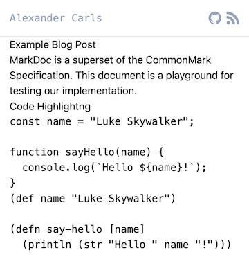
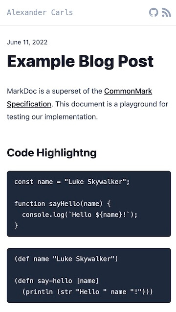
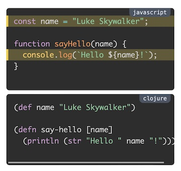
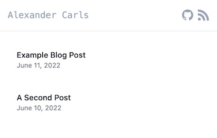

---
{
    :title "Create a blog with Clojure, nbb, and MarkDoc"
    :published-at #inst "2022-06-21"
}
---

# 

## The Plan

- Create a minimalistic blogging site to get started blogging about my Clojure journey.
- Write blog posts in Markdown
- Use functionality from [MarkDoc](https://markdoc.io) with React
- [Tailwind CSS](https://tailwindcss.com/)
- Create static HTML for each Markdown post.
- Deploy with [Netlify](https://www.netlify.com).
- Must work without JavaScript on the Browser
- RSS Feed
- Comments support with GitHub
- No CI/CD. Given the short scope of the project. Running commands on my local machine is OK.
- No Analytics

In essence, the Blog you are currently reading.
The repository is located at [alexandercarls/blog](https://github.com/alexandercarls/blog).

## Context

This endeavor is my first adventure with Clojure(script). Meaning this is from a Clojure beginner perspective.

Aside from my "normal" programming experience, regarding Clojure, I have done:
- read [Getting Clojure](https://pragprog.com/titles/roclojure/getting-clojure/) by Russ Olsen
- the [integrated guide from the Calva editor](https://calva.io/getting-started/#theres-a-getting-started-repl)
- watched countless of Clojure related videos

From various YouTube Videos, I discovered [nbb](https://github.com/babashka/nbb) and [babashka](https://github.com/babashka/babashka) for Clojure(Script) scripting.

For me, scripting is the perfect middle ground when going from small book exercises to more significant projects while learning the language. I'd argue that a static site book is on the larger side of "scripting".

This post is more or less a step-by-step blog post about how I built this blog you are reading.

I am unsure if this even helps anyone. However, I would argue that I would probably not have done it if it wasn't for the step-by-step progress, with small course corrections along the way.

This post assumes that you are working with macOS. The dependencies should be simple to install for your operating system of choice. A POSIX-compliant shell for the scripts is required.

## Install Dependencies and basic setup

Install global dependencies upfront via the package manager [Homebrew](https://brew.sh).

```shell
brew install node # https://nodejs.org/en/ LTS
npm i -g nbb # https://github.com/babashka/nbb
```

Create the project folder

```shell
# Create the project folder
mkdir blog
cd blog

mkdir posts # where our Markdown blog posts will reside.
```

In the `posts` folder, create a new folder for each blog post.
This approach has the benefit of co-locating every linked asset, such as images inside this folder.

The folder name is also the [slug (URL)](https://en.wikipedia.org/wiki/Clean_URL#Slug) of the post.

The actual Markdown file will be named `index.md`. The same concept as `index.html` or `index.js`.

Here are two example posts that I used.

```text
.
└── posts
    ├── a-second-post
    │   └── index.md
    └── my-first-post
        └── index.md
```


Content for `my-first-post/index.md`


````markdown
# Example Blog Post

MarkDoc is a superset of the [CommonMark Specification](https://commonmark.org).
This document is a playground for testing our implementation.

## Code Highlightng

```javascript
const name = "Luke Skywalker";

function sayHello(name) {
  console.log(`Hello ${name}!`);
}
```

```clojure
(def name "Luke Skywalker")

(defn say-hello [name]
  (println (str "Hello " name "!")))
```
````


Content for `a-second-post/index.md` (to test the index page)

````markdown
# A Second Post

Hello World!
````

More setup

```shell
touch build.cljs # the whole generator code will be here

# Setup `package.json` and install the first NPM dependencies
npm init -y
npm i zx @markdoc/markdoc

# https://www.npmjs.com/package/zx
# https://www.npmjs.com/package/@markdoc/markdoc
```

`zx` provides a few libraries we need for the scripts, such as `globby` and `fs-extra`.

## Find the posts

Open `build.cljs` and add the following lines

```clojure
(ns build
  (:require ["zx" :refer [glob]]
            [nbb.core :refer [await]]))

(comment
  (await (glob "posts/**/*.md"))
  ;; => #js ["posts/a-second-post/index.md" "posts/my-first-post/index.md"]
  )
```

When you evaluate the form inside [Rich Comments](https://calva.io/rich-comments/) you should get the relative path of both blog posts.

Note that we import Node.js libraries with double quotes and Clojure libraries without quotes.
nbb ships with quite a few helpful libraries for scripting. Take a look at the [API documentation](https://github.com/babashka/nbb/blob/main/doc/api.md).

[await](https://github.com/babashka/nbb/blob/main/src/nbb/core.cljs#L23) is a small helper function to wait for the promise from the `glob` function. The same notion as JavaScript `await`.

Let's move this out from the comment form and introduce the built-in [promesa](https://github.com/funcool/promesa) library that simplifies working with JavaScript Promises.


```clojure
(ns build
  (:require ["zx" :refer [glob]]
            [nbb.core :refer [await]]
            [promesa.core :as p]))

(defn build []
  (p/let [posts (glob "posts/**/*.md")
          posts (js->clj posts)]
    (prn posts)))

(build)

(comment
  (await (build))
  )
```

Great!

We can continue interacting with REPL or invoke the script with "nbb".

```shell
nbb build.cljs 
# prints ["posts/a-second-post/index.md" "posts/my-first-post/index.md"]
```

I also used the function [js->clj](https://cljs.github.io/api/cljs.core/js-GTclj) to convert the JavaScript array to a Clojure vector. The [#js literal](https://cljs.github.io/api/syntax/#js-literal) from the previous output is gone.

We can also continue using the `p/let` macro for non-promise bindings.

If you also use Calva VS Code Extension like me, you will likely get linter errors from [clj-kondo](https://github.com/clj-kondo/clj-kondo).
Let's adjust the config to teach clj-kondo about the `p/let` macro.

```shell
echo "{:lint-as {promesa.core/let clojure.core/let}}" > .clj-kondo/config.edn
```

## Read the file contents

We are using the built-in function slurp from nbb.

> `(slurp f)`: asynchronously slurps contents of file to string, returns result as promise.

Since we have multiple files, we can grab them all with the [Promise.all](https://developer.mozilla.org/en-US/docs/Web/JavaScript/Reference/Global_Objects/Promise/all) equivalent [p/all](https://github.com/funcool/promesa/blob/master/doc/user-guide.md#all).


```clojure 
(ns build
  (:require ["zx" :refer [glob]]
            [nbb.core :refer [slurp await]]
            [promesa.core :as p]))

(defn build []
  (p/let [posts (glob "posts/**/*.md")
          posts (js->clj posts)
          posts (p/all (map slurp posts))]
    (prn posts)))
;; ...
```

## Transform Markdown to HTML

Let's implement the [rendering pipeline from MarkDoc](https://markdoc.io/docs/render)

1. Parse Markdown to an Abstract Syntax Tree
2. Transform the AST to a Renderable Tree
3. Render the Tree to HTML

```clojure
(ns build 
  (:require ["zx" :refer [glob]]
            ["@markdoc/markdoc$default" :as markdoc]
            [nbb.core :refer [slurp await]]
            [promesa.core :as p]))

(defn build []
  (p/let [posts (glob "posts/**/*.md")
          posts (js->clj posts)
          posts (p/all (map slurp posts))
          posts-ast (map markdoc/parse posts)
          posts-tree (map markdoc/transform posts-ast)
          posts-html (map markdoc/renderers.html posts-tree)]
    (prn posts-html)
         posts-html))

(build)

(comment
  (await (build))
  ;; => ("<article><h1>A Second Post</h1><p>Hello World!</p></article>"
  ;;     "<article><h1>Example Blog Post</h1><p>MarkDoc is a superset of the <a href=\"https://commonmark.org\">CommonMark Specification</a>. This document is a playground for testing our implementation.</p><h2>Code Highlightng</h2><pre data-language=\"javascript\">const name = &quot;Luke Skywalker&quot;;\n\nfunction sayHello(name) {\n  console.log(`Hello ${name}!`);\n}\n</pre><pre data-language=\"clojure\">(def name &quot;Luke Skywalker&quot;)\n\n(defn say-hello [name]\n  (println (str &quot;Hello &quot; name &quot;!&quot;)))\n</pre></article>") 
  )
```

This was the technical breakthrough from reading files to outputting HTML. 
MarkDoc has two built-in renderers
1. HTML
2. React

Later we need to change this to React. First off with some improvements.

I want a function that works on individual items instead of the whole collection. That makes it also easier to play around with it.

We can also improve the usage of [p/all](https://github.com/funcool/promesa/blob/master/doc/user-guide.md#all).

Instead of just waiting for all the files to be slurped in and then follow-up with our Markdown rendering pipeline, we kick off the processing for an individual file as soon as a file is slurped in via promise chaining.

Promise chaining can quickly be verified with the JavaScript sandbox from [MDN](https://developer.mozilla.org/en-US/docs/Web/JavaScript/Reference/Global_Objects/Promise/all). Add `promise1.then(console.log)`.

```javascript 
const promise1 = Promise.resolve(3);
const promise2 = 42;
const promise3 = new Promise((resolve, reject) => {
  setTimeout(resolve, 100, 'foo');
});

Promise.all([promise1, promise2, promise3]).then((values) => {
  console.log(values);
});

promise1.then(console.log)

// expected output: 
// 3
// Array [3, 42, "foo"]

```

The `3` gets logged before we log all the contents from the `Promise.all` call.

> Good to know. Promises are evaluated eagerly. Meaning regardless of using `await` or `then`. As soon as they are constructed, they run.

We end up with the following

```clojure
;; ...

(defn markdown-to-html [markdown]
  (-> markdown
      (markdoc/parse)
      (markdoc/transform)
      (markdoc/renderers.html)))

(defn process-post-path [post-path]
  (p/-> (slurp post-path)
        (markdown-to-html)))

(defn build []
  (p/let [posts (glob "posts/**/*.md")
          posts (js->clj posts)
          posts (p/all (map process-post-path posts))]
    (prn posts)
         posts))

(build)

(comment
  (markdown-to-html "# Test")
  (await (build))
  )
```

We also used a new threading macro for promise chaining from promesa [p/->](https://github.com/funcool/promesa/blob/master/doc/user-guide.md#----and-as-).

The config for clj-kondo needs adjustment to the following content:

```edn
{:lint-as {promesa.core/let clojure.core/let promesa.core/-> clojure.core/->}}
```

## Static Site Generation

As you might have noticed we only output content in an HTML `<article></article>` tag.

We are missing the "host" of the post.

Create the `template.html` file at the root level of the project with the following content.

```html
<!DOCTYPE html>
<html lang="en">
  <head>
    <meta charset="utf-8" />
    <meta name="viewport" content="width=device-width, initial-scale=1" />
    <title>{{ TITLE }}</title>
  </head>
  <body>
    {{ CONTENT }}
  </body>
</html>
```

Note the variable "bits" that we need to replace.

Adjustments:
1. Load the template file
2. Replace "{{ CONTENT }}" with the post HTML. We will handle "{{ TITLE }}" later.
3. Write Blog Post to a new "dist" folder

```clojure
(ns build
  (:require ["zx" :refer [glob fs]]
            ["@markdoc/markdoc$default" :as markdoc]
            ["path" :as path]
            [nbb.core :refer [slurp await]]
            [clojure.string :as str]
            [promesa.core :as p]))

(def dist-folder "dist")
(def template (fs.readFileSync "template.html" "utf8"))

(defn markdown-to-html [markdown]
  (-> markdown
      (markdoc/parse)
      (markdoc/transform)
      (markdoc/renderers.html)))

(defn make-templated-html [title content]
  (as-> title $
    (str/replace template "{{ TITLE }}" $)
    (str/replace $ "{{ CONTENT }}" content)))

(defn process-post-path [post-path]
  (p/let [post (slurp post-path)
          post-html (markdown-to-html post)
          templated-html (make-templated-html "TODO" post-html)
          slug (-> (path/dirname post-path)
                   (path/basename))]
    {:path post-path
     :slug slug
     :html templated-html}))

(defn build []
  (fs.emptyDir dist-folder)
  (p/let [posts (glob "posts/**/*.md")
          posts (js->clj posts)
          posts (p/all (map process-post-path posts))
          _ (p/all
             (map (fn [p] (let [post-path (:path p)
                                destfolder (path/join dist-folder (:slug p))]
                            (p/do
                              (fs.emptyDir destfolder)
                              (fs.copy (path/dirname post-path) destfolder)
                              (fs.remove (path/join destfolder "index.md"))
                              (fs.writeFile (path/join destfolder "index.html") (:html p))))) posts))]
    (prn posts)
    posts))

(build)
```

**Some notes**
- I decided not to use `slurp` for reading the template. Instead, I used the `Sync` method.
- `process-post-path` is returning a map instead of just HTML
- To keep all blog-related assets, we need to copy the whole "post" folder to `dist`
- [fs.emptyDir](https://github.com/jprichardson/node-fs-extra/blob/master/docs/emptyDir.md#emptydirdir-callback) also creates the directory if it does not exist
- For the most part, if you see a JavaScript import like `import React from 'react'` you need to use the `$default` import. If you see `import { Component } from 'react'` you don't need it and can `:refer [Component]` instead. There are exceptions, especially when throwing CommonJS Modules into the mix. For ease of mind, the complexity wasn't added by ClojureScript.

The Post HTML is now correctly embedded. We now have a fully working Page, e.g. `a-second-post.

```html
<!DOCTYPE html>
<html lang="en">
  <head>
    <meta charset="utf-8" />
    <meta name="viewport" content="width=device-width, initial-scale=1" />
    <title>TODO</title>
  </head>
  <body>
    <article><h1>A Second Post</h1><p>Hello World!</p></article>
  </body>
</html>
```

## Introduce MarkDoc Frontmatter, Functions, and Variables

Setting the title of the HTML page is a bit more complicated.
Ideally, I'd like to re-use the `h1` tag (Markdown `#`) from the post itself.

We can extract the value of h1 from the renderable tree after `markdoc/transform`.

```json
{
    "$$mdtype": "Tag",
    "name": "article",
    "attributes": {},
    "children": [
        {
            "$$mdtype": "Tag",
            "name": "h1",
            "attributes": {},
            "children": [
                "A Second Post"
            ]
        }
    ]
}
```

Or, use more built-in features from MarkDoc - [Frontmatter](https://markdoc.io/docs/frontmatter) and [Variables](https://markdoc.io/docs/variables).

With Frontmatter, we can define metadata per post and provide them as variables for consumption.
My data format of choice is [edn](https://clojuredocs.org/clojure.edn).

While we are at it, let's also add a `published-at` date field.

Prepend each blog post with Frontmatter, and adjust the `#` (h1) and the "Published at" snippet.
We also use a [custom function](https://markdoc.io/docs/functions) `toHumanDate` and add a class `.published-at` [annotation](https://markdoc.io/docs/syntax#annotations) to a `p` node.

The `:published-at` value uses the edn built-in tagged element [#inst "rfc-3339-format"](https://github.com/edn-format/edn#inst-rfc-3339-format). This will yield us a [JavaScript Date object](https://developer.mozilla.org/en-US/docs/Web/JavaScript/Reference/Global_Objects/Date) when reading the edn string.


````markdown
---
{
    :title "Hello One"
    :published-at #inst "2022-06-10T22:00:01-07:00"
}
---

# 

Published at 
````

> Mind the unconventional edn curly bracket placement. This makes sure that my VS Code Markdown Preview doesn't break the syntax highlighting.

Now off to the implementation

```clojure 
(ns build
  (:require ["zx" :refer [glob fs]]
            ["@markdoc/markdoc$default" :as markdoc]
            ["path" :as path]
            [nbb.core :refer [slurp await]]
            [clojure.string :as str]
            [clojure.edn :as edn]
            [applied-science.js-interop :as j]
            [promesa.core :as p]))

;; ...

(defn date->human [date]
  (.toLocaleDateString date "en-US" #js {:year "numeric" :month "long" :day "numeric"}))
(def md-to-human-date {:transform (fn [parameters] (date->human (j/get parameters 0)))})

(defn parse-fronmatter [ast]r
  (when-let [frontmatter (j/get-in ast [:attributes :frontmatter])]
    (edn/read-string frontmatter)))

(defn markdown-to-html [markdown]
  (let [ast (markdoc/parse markdown)
        frontmatter (parse-fronmatter ast)
        rendertree (markdoc/transform ast (clj->js {:variables frontmatter :functions {:toHumanDate md-to-human-date}}))
        html (markdoc/renderers.html rendertree)]
    [html frontmatter]))

;; ...

(defn process-post-path [post-path]
  (p/let [post (slurp post-path)
          [post-html frontmatter] (markdown-to-html post)
          templated-html (make-templated-html (:title frontmatter) post-html)
          slug (-> (path/dirname post-path)
                   (path/basename))]
    {:path post-path
     :slug slug
     :html templated-html}))

;; ...
```

Worked! "A Second Post" now looks like this

```html 
<!DOCTYPE html>
<html lang="en">
<head>
  <meta charset="utf-8" />
  <meta name="viewport" content="width=device-width, initial-scale=1" />
  <title>A Second Post</title>
</head>
<body>
  <article>
    <h1>A Second Post</h1>
    <p>Hello World!</p>
    <p class="published-at">Published at June 11, 2022</p>
  </article>
</body>
</html>
```

**Some notes**
- Parsed the Frontmatter as edn data.
- We enriched the `markdoc/transform` function with additional info about Frontmatter as variables and the `md-to-human-date` map as a function.
- `markdown-to-html` now returns a tuple HTML and Frontmatter. We then used array destructuring in a let binding ` [article-html frontmatter] (markdown-to-html source)`.
- We have come across more JavaScript interop via the library [js-interop](https://github.com/applied-science/js-interop). And again, the [#](https://cljs.github.io/api/syntax/js-literal)js literal](https://cljs.github.io/api/syntax/js-literal). The literal shallow converts the data structure to JavaScript. We could also have used the `js->clj` macro. And finally the [. special form](https://cljs.github.io/api/cljs.core/DOT). At the beginning of my journey, I forgot several times that you could not do `instance.method` or get map keys via `.` chaining and need to use `get` etc.
- One learning for me is probably to stick with simple `let` bindings in the beginning and clean it up with threading macros afterward for debugging purposes etc. I constantly shifted around threading macros.

I occasionally insert one of the following statements for debugging at various places.

```clojure
(prn frontmatter)
(fs.writeFileSync "ast.json" (js/JSON.stringify ast))
_ (prn data) ; in a let binding
```

## Styling with Tailwind CSS
 

As you can imagine, the post doesn't look great.

Add some styling to our pages with [Tailwindwind CSS](https://tailwindcss.com/docs/installation), a utility-first CSS framework using the provided CLI.

```shell
npm install -D tailwindcss @tailwindcss/typography

cat << EOF > tailwind.config.js
/** @type {import('tailwindcss').Config} */
module.exports = {
  content: ["./dist/**/*.html"],
  theme: {
    extend: {},
  },
  plugins: [
   require('@tailwindcss/typography')
  ],
}
EOF

cat << EOF > base.css
@tailwind base;
@tailwind components;
@tailwind utilities;
EOF
```

```shell
npx tailwindcss -i ./base.css -o ./dist/output.css --watch
```

If you inspect the `output.css` file you can see foundational styles.

The command starts a long-running watch process.
If we now generate HTML files in the `dist` folder, the process picks up the changes, extracts the CSS classes and rebuilds the `output.css` file.

## template.html

Let's reference the CSS file from our `template.html` file and adjust the styling.

```html
<!DOCTYPE html>
<html lang="en">

<head>
  <meta charset="utf-8" />
  <meta name="viewport" content="width=device-width, initial-scale=1" />
  <title>{{ TITLE }}</title>
  <link href="../output.css" rel="stylesheet">
</head>

<body>
  <div class="w-full border-b border-slate-900/10">
    <div class="max-w-7xl mx-auto">
      <div class="py-4 lg:px-8 px-4">
        <div class="flex items-center justify-between">
          <a class="mr-3 font-mono text-slate-400 hover:text-slate-500"
            href="/">
            Alexander Carls
          </a>
          <div class="flex gap-2">
            <a href="https://github.com/alexandercarls/blog" class="block text-slate-400 hover:text-slate-500">
              <svg viewBox="0 0 16 16" class="w-5 h-5" fill="currentColor">
                <path
                  d="M8 0C3.58 0 0 3.58 0 8c0 3.54 2.29 6.53 5.47 7.59.4.07.55-.17.55-.38 0-.19-.01-.82-.01-1.49-2.01.37-2.53-.49-2.69-.94-.09-.23-.48-.94-.82-1.13-.28-.15-.68-.52-.01-.53.63-.01 1.08.58 1.23.82.72 1.21 1.87.87 2.33.66.07-.52.28-.87.51-1.07-1.78-.2-3.64-.89-3.64-3.95 0-.87.31-1.59.82-2.15-.08-.2-.36-1.02.08-2.12 0 0 .67-.21 2.2.82.64-.18 1.32-.27 2-.27.68 0 1.36.09 2 .27 1.53-1.04 2.2-.82 2.2-.82.44 1.1.16 1.92.08 2.12.51.56.82 1.27.82 2.15 0 3.07-1.87 3.75-3.65 3.95.29.25.54.73.54 1.48 0 1.07-.01 1.93-.01 2.2 0 .21.15.46.55.38A8.013 8.013 0 0016 8c0-4.42-3.58-8-8-8z">
                </path>
              </svg>
            </a>
            <a href="/rss.xml" class="block text-slate-400 hover:text-slate-500">
              <svg viewBox="0 0 461.4 461.4" class="w-5 h-5" style="enable-background:new 0 0 461.432 461.432"
                fill="currentColor">
                <path
                  d="M126 399a61 61 0 1 1-122 0 61 61 0 0 1 122 0zM0 230c0 8 7 15 15 15 60 4 101 25 138 63 37 37 60 90 64 138 1 8 8 14 16 14h57a16 16 0 0 0 16-16A299 299 0 0 0 17 157a16 16 0 0 0-17 16v57z" />
                <path
                  d="M0 73c0 9 7 16 15 16 194 8 351 162 358 356 1 9 8 15 16 15h57a16 16 0 0 0 15-16A456 456 0 0 0 16 1 16 16 0 0 0 0 17v56z" />
              </svg>
            </a>
          </div>
        </div>
      </div>
    </div>
  </div>
  <div class="overflow-hidden">
    <div class="px-4 sm:px-6 md:px-8">
      <div class="max-w-3xl mx-auto pb-28">
        <main>
          {{ CONTENT }}
        </main>
      </div>
    </div>
  </div>
</body>

</html>
```

Finished template. Truly minimalistic.



## Add a Post Layout

For the post layout, we use React with [Reagent](https://github.com/reagent-project/reagent) instead of loading up an HTML template file and using string replacements.

```shell
npm i react react-dom
```

Reagent uses a [Hiccup](https://github.com/weavejester/hiccup) with some extensions.

I used both of the following HTML to Hiccup online converters when I was unsure how to translate HTML to Hiccup.
- [html2hiccup.buttercloud.com](http://html2hiccup.buttercloud.com/)
- [htmltohiccup.herokuapp.com](https://htmltohiccup.herokuapp.com/)


```clojure 
;; Require these dependencies
["react$default" :as React]
[reagent.dom.server :as srv]

;; ...

(defn markdown-to-react-elements [markdown]
  (let [ast (markdoc/parse markdown)
        frontmatter (parse-fronmatter ast)
        rendertree (markdoc/transform ast (clj->js {:variables frontmatter :functions {:toHumanDate md-to-human-date}}))
        react-elements (markdoc/renderers.react rendertree React)]
    [react-elements frontmatter]))

(defn make-templated-html [title content]
  (as-> title $
    (str/replace template "{{ TITLE }}" $)
    (str/replace $ "{{ CONTENT }}" content)))

(defn post-layout [date content]
  [:article.relative.pt-8.mt-6
   [:div.text-sm.leading-6
    [:dl
     [:dd.absolute.top-0.inset-x-0.text-slate-700
      [:time {:date-time (.toISOString date)} (date->human date)]]]]
   [:div.prose.prose-slate.max-w-none content]])

(defn process-post-path [post-path]
  (p/let [post (slurp post-path)
          [post-react-element frontmatter] (markdown-to-react-elements post)
          post-html (srv/render-to-static-markup (post-layout (:published-at frontmatter) post-react-element))
          templated-html (make-templated-html (:title frontmatter) post-html)
          slug (-> (path/dirname post-path)
                   (path/basename))]
    {:path post-path
     :slug slug
     :html templated-html}))
;; ...
```

**Some notes**
- Most of the styling work is done with the `prose` class from the [@tailwindcss/typography](https://tailwindcss.com/docs/typography-plugin) plugin. 
- We changed the MarkDoc renderer from HTML to React, and now return React Elements instead of plain HTML
- Used the Reagent version of [ReactDOMServer.renderToStaticMarkup(element)](https://reactjs.org/docs/react-dom-server.html#rendertostaticmarkup)
- To be honest, at first, I was unsure if I like chaining the classes on the elements with Hiccup `:article.relative.pt-8.mt-6.`. Now I am okay-ish with it. An alternative syntax for applying classes would be this `[:article {:class "relative pt-8 mt-6"} "..."]`



## Add React components

Now that we are using the React renderer, it's time to add some React components.
We don't use this for interactivity on the client-side, we use it for encapsulation and some components from the React ecosystem. Keep in mind we are rendering static markup and don't hydrate on the client with this blog post.

In both cases, we are [customizing existing MarkDoc nodes](https://markdoc.io/docs/nodes#customizing-markdoc-nodes).

### Heading

Headings should be clickable. This is not built-in, we need to wrap them in an anchor tag ourselves.

We generate a unique id for the Heading based on the content via the [@sindresorhus/slugify](https://www.npmjs.com/package/@sindresorhus/slugify) library. And then wrap the heading with an anchor tag,
link to the id with a fragment identifier.

```clojure 
;; Change/add require
["@markdoc/markdoc$default" :as markdoc :refer [Tag]]
["@sindresorhus/slugify$default" :as slugify]
[reagent.core :as r]

;; Add
(defn Heading [{:keys [id level children]}]
  (let [heading-tag (if (= level 1)
                      [:h1.not-prose.text-2xl.font-extrabold.tracking-tight.text-slate-900.md:text-3xl {:id id} children]
                      [(keyword (str "h" level)) {:id id :class "text-lg md:text-2xl"} children])]
    [:a.no-underline.relative {:href (str "#" id)} heading-tag]))

(def node-heading {:render "Heading"
                   :children ["inline"]
                   :attributes {:id {:type 'String}
                                :level {:type 'Number :required true :default 1}}
                   :transform (fn [node config] (let [attributes (.transformAttributes node config)
                                                      children (.transformChildren node config)
                                                      id (slugify (first children))]
                                                  (Tag.
                                                   "Heading"
                                                   (clj->js (into (js->clj attributes) {:id id}))
                                                   children)))})

;; Change
(defn markdown-to-react-elements [markdown]
  (let [ast (markdoc/parse markdown)
        frontmatter (parse-fronmatter ast)
        rendertree (markdoc/transform ast (clj->js {:variables frontmatter
                                                    :functions {:toHumanDate md-to-human-date}
                                                    :nodes {:heading node-heading}}))
        react-elements (markdoc/renderers.react
                        rendertree
                        React
                        (clj->js {:components {"Heading" (r/reactify-component Heading)}}))]
    [react-elements frontmatter]))
```

```shell
npm i @sindresorhus/slugify 
```

**Some notes**
- The referenced React component and Nodes (e.g. "**H**eading") must have the first character in uppercase. Otherwise, MarkDoc doesn't match the Node with the React component.
- We don't support document unique id when we have the same heading content. You would need to suffix the generated id with an increasing number.
- `(keyword (str "h" level)` is a neat trick to instantiate a dynamic `h` keyword tag. Although `str ("h" level)` would have worked just as fine.


```html
<h2 id="code-highlightng" class="text-lg md:text-2xl">Code Highlightng</h2>
```


### Code Syntax Highlighting

 Reading code snippets without syntax highlighting isn't fun.

Let's use the React component [prism-react-renderer](https://github.com/FormidableLabs/prism-react-renderer) with [Prism](https://prismjs.com/#basic-usage-node) on Node.js to highlight our code snippets. I choose "prism-react-render" as they already implemented a concept of "lines" that we can leverage for highlighting specific lines.

The Prism plugins we were interested in [don't work on the Node environment](https://github.com/PrismJS/prism/issues/1171) and require the browser DOM. Hence the component is a fitting solution.

```shell
npm i prism-react-renderer prismjs
```

```clojure 
;; Add require
["prism-react-renderer$default" :refer [Prism]]
["prism-react-renderer$default.default" :as Highlight]

;; ...
(defn add-prismjs-language [language]
  (set! (.-Prism js/global) Prism)
  ((js/require "prismjs/components/") language))

(add-prismjs-language "clojure")

(defn is-line-highlighted-fn [highlight]
  (let [lines (->> (str/split highlight #",")
                   (map #(js/parseInt % 10))
                   (set))]
    (fn [n] (some #(= n %) lines))))

(defn Fence [{:keys [language highlight content]}]
  [:> Highlight {"Prism" Prism :code content :theme nil :language language}
   (fn [params] (let [{tokens "tokens"
                       class "className"
                       style "style"
                       get-line-props "getLineProps"
                       get-token-props "getTokenProps"} (js->clj params)
                      line-highlighted? (is-line-highlighted-fn highlight)]
                  (r/as-element [:div.relative>pre.grid {:class [class] :style style}
                                 (map-indexed (fn [il line]
                                                [:div
                                                 (update-in (js->clj (get-line-props #js {:line line :key il}) :keywordize-keys true) [:class] conj (when (line-highlighted? (inc il)) "-mx-4 px-[0.7rem] border-l-4 border-yellow-400 bg-yellow-300/[0.25]"))
                                                 (map-indexed (fn [it token] [:span (js->clj (get-token-props (clj->js {:token token :key it})) :keywordize-keys true)])
                                                              line)]) tokens)
                                 [:div.absolute.top-0.right-0.rounded-b-lg.bg-gray-600.text-xs.text-slate-200.p-2.mr-2.font-mono
                                  {:style {:text-shadow "none" :line-height "0.2rem"}}
                                  language]])))])

(def node-fence {:render "Fence"
                 :attributes {:content {:type 'String}
                              :highlight {:type 'String}
                              :language {:type 'String}}})

;; ...

(defn markdown-to-react-elements [markdown]
  (let [ast (markdoc/parse markdown)
        frontmatter (parse-fronmatter ast)
        rendertree (markdoc/transform ast (clj->js {:variables frontmatter
                                                    :functions {:toHumanDate md-to-human-date}
                                                    :nodes {:heading node-heading
                                                            :fence node-fence}}))
        react-elements (markdoc/renderers.react
                        rendertree
                        React
                        (clj->js {:components {"Heading" (r/reactify-component Heading)
                                               "Fence" (r/reactify-component Fence)}}))]
    [react-elements frontmatter]))
```

**Some Notes**

Clojure isn't bundled by "prism-react-renderer" we dynamically load the language with "prismjs". In the future, we can load every supported language dynamically depending on the language of the fence node.

With the following function, we patch the [global Node.js object](https://nodejs.org/api/globals.html#global) as explained in the [components FAQ](https://github.com/FormidableLabs/prism-react-renderer#faq).

The language loader exported from `prismjs/components` uses `require()` to load up the language files such as the [Clojure file](https://github.com/PrismJS/prism/blob/master/components/prism-clojure.js#L2). Note the highlighted line where "Prism" is accessed without an import. This means that the "global" object is being used instead. That's why we patch it before adding more languages. This took a while to implement.

```clojure
(defn add-prismjs-language [language]
  (set! (.-Prism js/global) Prism)
  ((js/require "prismjs/components/") language))

;; (j/get-in js/global ["Prism" "languages" "clojure"])
;; (j/get-in Prism ["languages" "clojure"])
```

We added individual line highlights by extending the existing "Fence" (`fence-node`) with the attribute "highlight.

````markdown
```javascript 
const name = "Luke Skywalker";

function sayHello(name) {
  console.log(`Hello ${name}!`);
}
```
````

The function `is-line-highlighted-fn` is also interesting. It splits the string "1,4" by `,` and returns a closure that accepts a line number and returns a truthy value when the line is present in the enclosed highlighted numbers.

Sometimes I used a [JavaScript to ClojureScript translator](https://roman01la.github.io/javascript-to-clojurescript/) to get a hint of some required syntax I didn't know yet.

**CSS**

Download a minified CSS theme of your choice and inline it into `base.css`.

For example

```
@tailwind base;
@tailwind components;
@tailwind utilities;

/* PrismJS 1.28.0
https://prismjs.com/download.html#themes=prism-tomorrow&languages=markup+css+clike+javascript+clojure */
code[class*=language-],pre[class*=language-]{color:#ccc;background:0 0;font-family:Consolas,Monaco,'Andale Mono','Ubuntu Mono',monospace;font-size:1em;text-align:left;white-space:pre;word-spacing:normal;word-break:normal;word-wrap:normal;line-height:1.5;-moz-tab-size:4;-o-tab-size:4;tab-size:4;-webkit-hyphens:none;-moz-hyphens:none;-ms-hyphens:none;hyphens:none}pre[class*=language-]{padding:1em;margin:.5em 0;overflow:auto}:not(pre)>code[class*=language-],pre[class*=language-]{background:#2d2d2d}:not(pre)>code[class*=language-]{padding:.1em;border-radius:.3em;white-space:normal}.token.block-comment,.token.cdata,.token.comment,.token.doctype,.token.prolog{color:#999}.token.punctuation{color:#ccc}.token.attr-name,.token.deleted,.token.namespace,.token.tag{color:#e2777a}.token.function-name{color:#6196cc}.token.boolean,.token.function,.token.number{color:#f08d49}.token.class-name,.token.constant,.token.property,.token.symbol{color:#f8c555}.token.atrule,.token.builtin,.token.important,.token.keyword,.token.selector{color:#cc99cd}.token.attr-value,.token.char,.token.regex,.token.string,.token.variable{color:#7ec699}.token.entity,.token.operator,.token.url{color:#67cdcc}.token.bold,.token.important{font-weight:700}.token.italic{font-style:italic}.token.entity{cursor:help}.token.inserted{color:green} 
```

Good enough




## Add a Dev HTTP Server

Currently, we open the HTML file via our Browser directly from the file system.

The URL looks like this `[...]/my-first-post/index.html` This is not a good URL to publish to the internet
and certainly not what most web servers do by default.

For example, Netlify serves `index.html` as the default file for any directory requests. Our "file system" setup does not.

We can spin up an HTTP Server ([http-server](https://www.npmjs.com/package/http-server)) that also shares the same behavior. The library calls those "Magic Files".


```shell
npx http-server ./dist
```

Open [http://localhost:8080/my-first-post/](http://localhost:8080/my-first-post/).  
Done.

## Index Page

```clojure 
;; Add `:frontmatter frontmatter` to the returned map of `process-post-path`.

(defn build-index-page [data]
  [:ul.mt-3
   (for [{:keys [frontmatter slug]} data]
     [:li.relative.bg-white.py-5.px-4.hover:bg-gray-50.focus-within:ring-2.focus-within:ring-inset.focus-within:ring-indigo-600
      {:key slug}
      [:div.flex-col.md:flex-row.flex.md:justify-between.md:items-center
       [:div.min-w-0.flex-1
        [:a.block.focus:outline-none
         {:href slug}
         [:span.absolute.inset-0]]
        [:p.text-sm.font-medium.text-gray-900.truncate
         (:title frontmatter)]]
       [:time.flex-shrink-0.whitespace-nowrap.text-xs.text-gray-500
        {:date-time (.toISOString (:published-at frontmatter))}
        (date->human (:published-at frontmatter))]]])])

(defn build []
  (fs.emptyDir dist-folder)
  (p/let [posts (glob "posts/**/*.md")
          posts (js->clj posts)
          posts (p/all (map process-post-path posts))
          posts (sort-by #(- (:published-at (:frontmatter %))) posts)
          _ (p/all
             (map (fn [p] (let [post-path (:path p)
                                destfolder (path/join dist-folder (:slug p))]
                            (p/do
                              (fs.emptyDir destfolder)
                              (fs.copy (path/dirname post-path) destfolder)
                              (fs.remove (path/join destfolder "index.md"))
                              (fs.writeFile (path/join destfolder "index.html") (:html p))))) posts))
          index-page (build-index-page posts) 
          index-page (srv/render-to-static-markup index-page)
          index-page (make-templated-html "Alexander Carls" index-page)]
    (fs.writeFile (path/join dist-folder "index.html") index-page)))
```

We also needed to sort the blog posts according to the published date.



## RSS Feed

As an avid RSS feed consumer, I think that every content-producing website must have an RSS feed.

- [RSS 2.0 Specification](https://www.rssboard.org/rss-specification)
- [RSS Validator](https://validator.w3.org/feed/#validate_by_input)


```clojure
(def site-url "http://www.alexandercarls.de/")

(defn build-rss-feed [posts]
  (str "<?xml version=\"1.0\" encoding=\"UTF-8\" ?>
        <rss version=\"2.0\" xmlns:atom=\"http://www.w3.org/2005/Atom\">
         <channel>
          <title>Alexander Carls</title>
          <description>Blog</description>
          <link>" site-url "</link>
       <atom:link href=\"" site-url "rss.xml\" rel=\"self\" type=\"application/rss+xml\" />"
       (apply str (map #(str "<item>
            <guid>" site-url (:slug %) "</guid>
            <title>" (get-in % [:frontmatter :title]) "</title>
            <link>" site-url (:slug %) "</link>
            <pubDate>" (.toUTCString (get-in % [:frontmatter :published-at])) "</pubDate>
          </item>") posts))
       "</channel>
</rss>"))

;; Add the following to the `build` function
(fs.writeFile (path/join dist-folder "rss.xml") (build-rss-feed posts))
```

Clicking on the top right RSS icon works now.
Also, add the following to the `template.html` file. I heard that this helps some RSS feed readers with the discovery.

```html
 <link rel="alternate" type="application/rss+xml" title="Alexander Carls Blog Feed" href="http://alexandercarls.de/rss.xml" />
 ```

## Comment System

Let's add [utteranc.es](https://utteranc.es) for our comment system. Aside from the many other benefits listed at their page,
the main selling point for me is that comments are stored in the repository with GitHub issues.

The installation steps are also simple to follow.

Let's add the script to the post-layout.

```clojure 
(defn post-layout [date content]
  [:article.relative.pt-8.mt-6
   [:div.text-sm.leading-6
    [:dl
     [:dd.absolute.top-0.inset-x-0.text-slate-700
      [:time {:date-time (.toISOString date)} (date->human date)]]]]
   [:div.prose.prose-slate.max-w-none content]
   [:script {:src "https://utteranc.es/client.js", :repo "alexandercarls/blog", "issue-term" "pathname", :theme "github-light", :cross-origin "anonymous", :async true}]])
```

To post comments from the site you must authorize utterances to post on your behalf. You can also reply to the issue directly on GitHub. 

## Small changes

Center images; add to `base.css`

```css
p > img {
    margin: auto;
}
```

We no longer use the MarkDoc function `toHumanDate`. We added the published date to the `h1` rendering.

```clojure
:functions {:toHumanDate md-to-human-date}
```

## To Production

Before the deployment, we [optimize Tailwind CSS for production](https://tailwindcss.com/docs/optimizing-for-production).

```shell
npx tailwindcss -i ./base.css -o ./dist/output.css --minify
```

I thought that this section would be longer and needed explanation. I was surprised that Netlify revived the good old Drag and Drop and makes this an easy three-step process.

1. Register with the option for manual deployments
2. Drag and Drop the "dist" folder to the deployment.
3. Point a domain to the site.

---

Hopefully, this post is helpful to someone :)